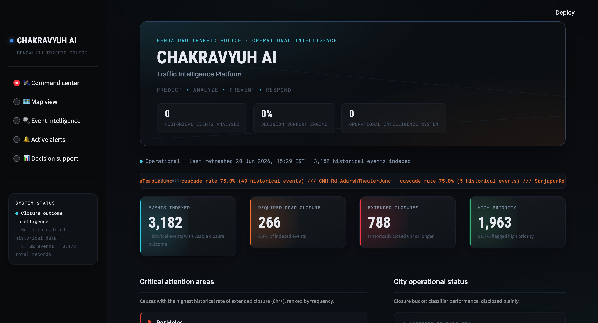
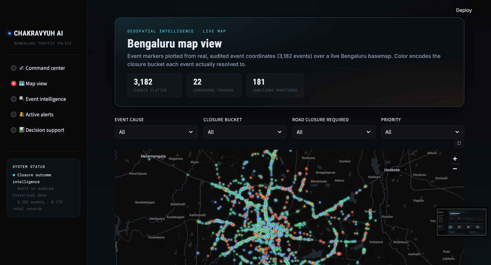

Chakravyuh AI — Closure Outcome Intelligence

Live Demo

Demo: <[deployment-link](https://chakravyuh-ai-asz6pnxrwmxkrzffx6vbyf.streamlit.app/)>

Video Walkthrough: <video-link>


⸻

## Screenshots

### Command Center



### Bengaluru Map Intelligence



## Tech Stack

- Python
- Streamlit
- Scikit-Learn
- Pandas
- NumPy
- Plotly
- OpenStreetMap
- KNN Retrieval
- Random Forest

Overview

Chakravyuh AI is an operational traffic intelligence platform built for Bengaluru Traffic Police.

Instead of generating black-box predictions, the system combines:

* Closure outcome prediction
* Historical evidence retrieval
* Geospatial traffic intelligence
* Cascade-risk monitoring
* Operator decision support

The platform was developed after a complete audit of the provided dataset to determine which analytical capabilities were actually supportable by the available data.

⸻

Key Features

Operational Command Center

* City-wide operational dashboard
* Historical closure intelligence
* High-risk cause identification
* Cascade hotspot monitoring
* Explainable metrics and reliability disclosure

Bengaluru Geospatial Intelligence

* Real Bengaluru basemap
* 3,182 audited historical events plotted
* Interactive filtering by cause, closure bucket, priority, and road closure requirement
* Corridor risk overlay
* Junction cascade monitoring

Event Intelligence Panel

* Closure bucket prediction
* Historical nearest-neighbor evidence retrieval
* Confidence estimation
* Impact assessment
* Cascade frequency indicators
* Explainable AI workflow

Active Alerts

* High-impact event patterns
* Historical cascade alerts
* Junction monitoring
* Operational attention recommendations

Decision Support

* Ranked intervention areas
* Impact-based prioritization
* Historical evidence-backed recommendations
* Transparent operational intelligence

⸻

Why this exists

The original project direction included duration regression.

A complete dataset audit showed that approach was not defensible:

* Only 39.1% of events contain usable duration labels
* A significant portion of duration values contain administrative artifacts
* Multiple regression models failed to outperform a naive baseline

Rather than deploy misleading predictions, the platform was redesigned around capabilities that the data genuinely supports:

1. Closure outcome classification
2. Historical evidence retrieval
3. Impact assessment
4. Cascade intelligence
5. Decision support

## Audit evidence (frozen, do not re-tune without re-auditing)

| Finding | Number |
|---|---|
| Total events | 8,173 |
| Events with usable duration label | 3,195 (39.1%) |
| After removing negative-duration errors and missing-feature rows | 3,182 |
| Duration regression: best model CV R^2 (realistic <=24hr subset) | 0.218, MAE still worse than median baseline |
| Closure bucket classifier: CV accuracy | 0.573 (vs. 0.471 majority-class baseline) |
| Closure bucket classifier: CV macro-F1 | 0.460 (vs. 0.160 baseline) |
| Junction field completeness | 30.7% |
| Cascade clustering: consecutive same-junction gaps <=2hr | 15.8% (vs. 68.3hr median gap) |
| Severity/impact label in source data | None exists -- impact index is a derived formula |

Full numbers are persisted in `artifacts/metrics.json`,
`artifacts/cause_tail_weights.json`, and `artifacts/cascade_rates.json`
after running the training scripts, so every figure shown in the demo
traces back to a file, not a claim.

## Architecture

Three layers, frozen after a Round 2 consistency check that explicitly
tested (not assumed) feasibility of each piece:

1. **Prediction layer** -- RandomForest classifier predicting a closure
   bucket (`<=1hr`, `1-6hr`, `6-24hr`, `>24hr`) from `event_cause`,
   `requires_road_closure`, `corridor`, `priority`, `police_station`,
   `latitude`/`longitude`, and engineered `hour`/`day-of-week`/`month`.
2. **Evidence layer** -- k-nearest-neighbor retrieval over the same kind
   of feature space, returning the actual historical events nearest to
   the current one and what bucket they landed in. This is what makes
   every prediction explainable and gives the operator something to
   cross-check the classifier against.
3. **Decision layer** -- combines the above two with the impact index and
   cascade frequency indicator into one operator-facing panel, with
   disclosed limitations always visible.

What got dropped and why: duration regression (no MAE improvement over
baseline), officer-level assignment (`assigned_to_police_id` 98.4%
missing), directional routing (`direction` 99.5% missing), and a trained
cascade-prediction model (no cascade label exists, junction only 30.7%
populated). See `src/features/build_features.py` and
`src/inference/cascade_indicator.py` docstrings for the full reasoning.

## Repository structure

See `STRUCTURE.txt` for the annotated tree.

## Build and run

```bash
pip install -r requirements.txt

# One command to build every artifact (recommended):
python -m src.models.train_all data/raw/astram_event_data.csv

# Or run each step individually:
python src/features/build_features.py data/raw/astram_event_data.csv data/processed/model_df_full.csv
python src/models/train_classifier.py
python src/models/train_similarity.py
python src/inference/impact_index.py
python src/inference/cascade_indicator.py data/raw/astram_event_data.csv

# Then run the app
streamlit run app.py
```

To integrate into the existing Chakravyuh AI app instead of running this
as a standalone demo, see `INTEGRATION.md`.

## Product layer: Traffic Command Center

Built on top of the frozen backend without modifying it. Five screens,
routed from a persistent navigation rail in `app.py`:

1. **Command center homepage** (`app/pages/home.py`) — control-room
   summary cards, critical attention areas, city operational status,
   and the junction-watch ticker.
2. **Bengaluru map view** (`app/pages/map_view.py`) — real event
   coordinates from the audited table, filterable by cause, bucket,
   closure, and priority; corridor and junction risk lists alongside.
3. **Event intelligence panel** (`app/pages/event_intelligence.py`) —
   wraps the existing, tested `app/closure_panel.py` (classifier
   prediction, nearest-neighbor evidence, impact index, cascade
   indicator, explainability) with command-center framing.
4. **Active alerts feed** (`app/pages/alerts.py`) — impact alerts by
   cause, cascade frequency alerts by junction, high-risk corridor
   notifications — explicitly labeled as historical-pattern alerts,
   not a live incident stream.
5. **Decision support panel** (`app/pages/decision_support.py`) —
   combines impact index, cascade indicator, and historical evidence
   into a ranked attention-area summary.

All five screens read exclusively through `app/services/data_service.py`,
a thin caching/aggregation layer over the frozen artifacts — no model
logic, feature engineering, or training code lives in `app/`.

Run the full command center with `streamlit run app.py`.

## Testing

```bash
pytest tests/ -v
```

`tests/test_app_pages.py` uses Streamlit's `AppTest` harness to actually
run each of the five screens through Streamlit's script engine and
assert no exceptions — a stronger check than an HTTP boot test, since
page switches happen via widget interaction within one script.


- Label coverage is 39.1% of all events; the classifier is trained and
  evaluated only on the subset with a usable duration label.
- The `1-6hr` bucket is the hardest to classify (test recall ~0.16-0.28)
  due to a smaller sample size (n=126) relative to the other buckets.
- `junction` is only 30.7% populated; the cascade indicator falls back to
  a population-level statistic when junction is missing or has fewer
  than 5 historical events, and the UI labels which source was used.
- The impact index weighting (0.4 / 0.3 / 0.3) is a stated design choice,
  not a learned weighting -- there is no ground-truth impact label in the
  source data to learn from.
